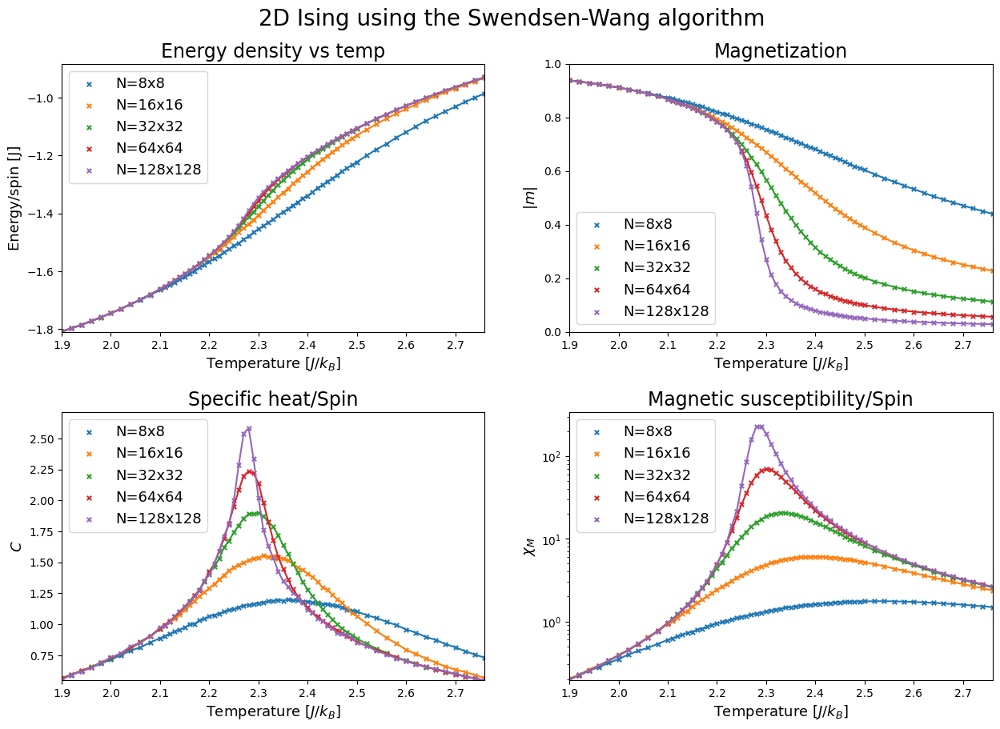
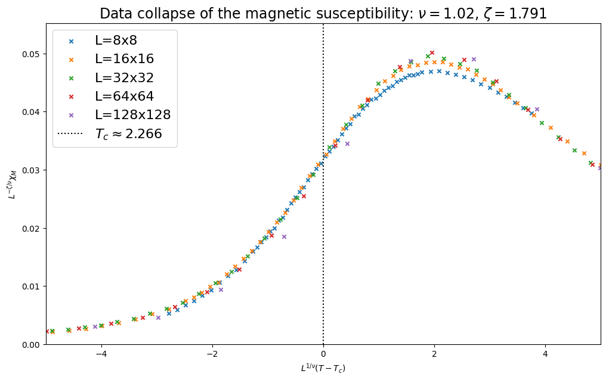

# Solving the 2D Ising model using the Swendsen-Wang cluster algorithm

### TODO:
* finish documentation
* add critical temperature estimation from specific-heat-peak scaling
* add python gif animation to show algorighm
* Make better plots for $1024 \times 1024$ 

## Phase Diagram
Preliminary results:

## Finite Size Scaling

